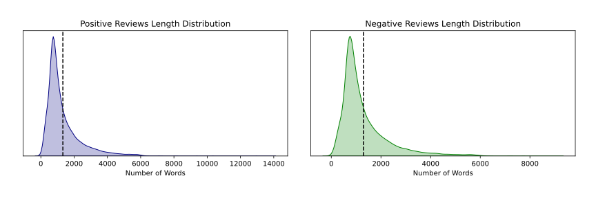
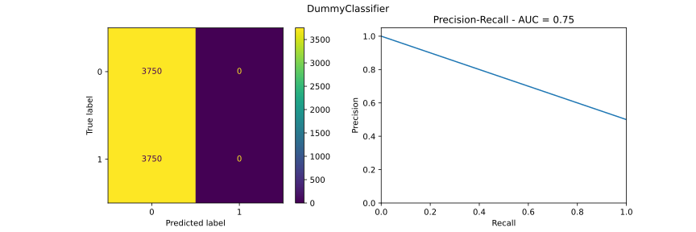
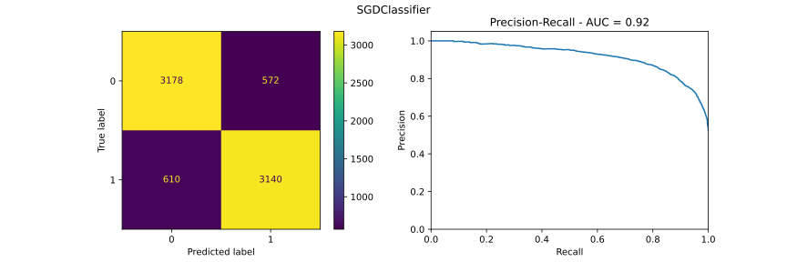
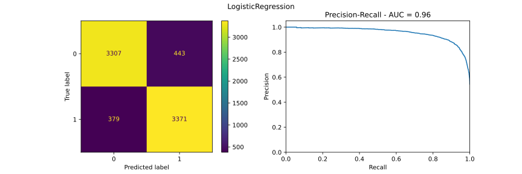
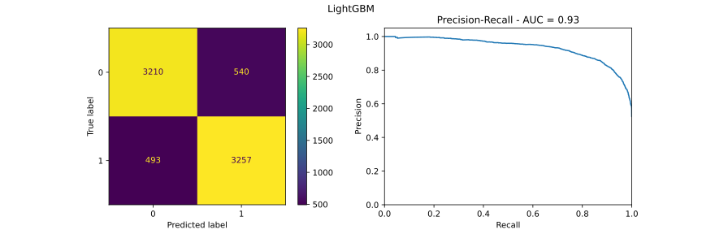
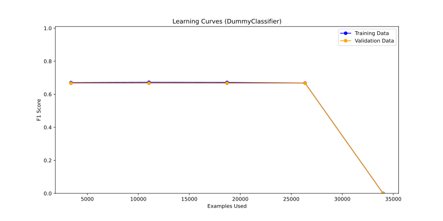
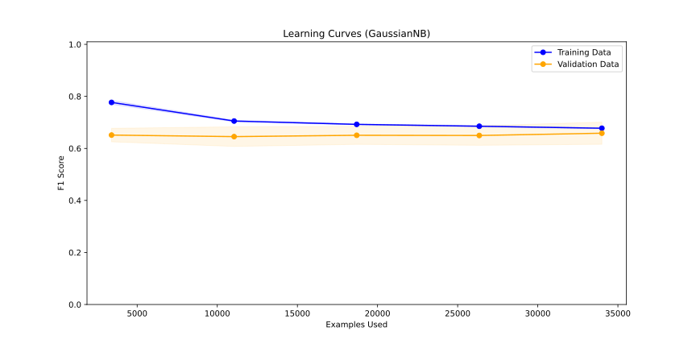
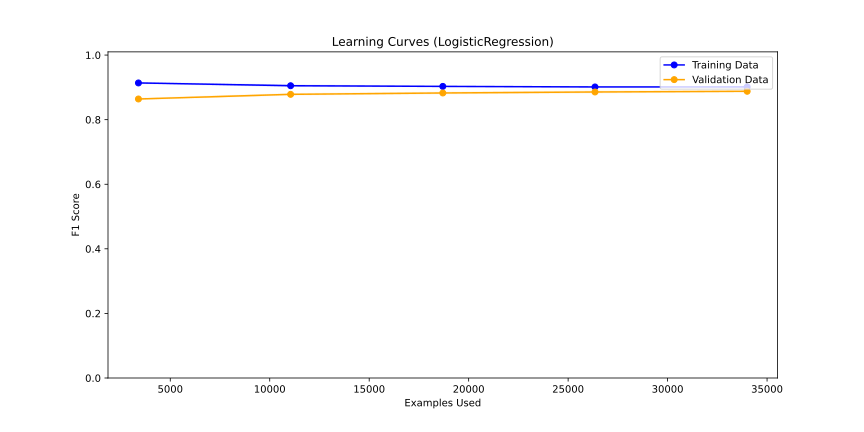
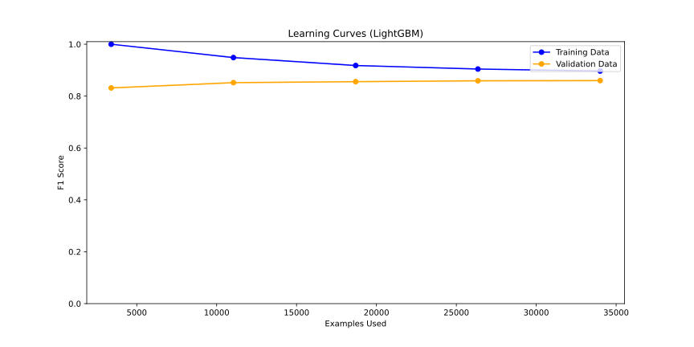

# Text Classification w. Basic Models

*Text Analytics*  
*MSc in Data Science, Department of Informatics*  
*Athens University of Economics and Business*


## *Table of Contents*

1. [Introduction](#introduction)
2. [Project Overview](#project-overview)
3. [Data](#data)
4. [Resources](#resources)
5. [Data Preprocessing](#data-preprocessing)
6. [Predictions](#predictions)

## *Introduction*

- **Natural language processing (NLP)** is a subfield of linguistics, computer science, and artificial intelligence
- NLP is concerned with the interactions between computers and human language
- Sentiment analysis is a NLP technique used to determine whether data is positive, negative or neutral
- It is performed on textual data to identify, extract, quantify, and study subjective information
- Furthermore, it helps businesses understand the social sentiment of their brand, product or service

## *Project Overview*

- The scope of this project was to develop a sentiment classifier for movie reviews
- For this purpose we used the [Large Movie Review Dataset](https://ai.stanford.edu/~amaas/data/sentiment/) by Andrew Maas
- First, we extracted some descriptive statistics such as vocabulary size, reviews length etc.
- Then, we preprocessed the reviews using mostly the `nltk` library
- We split the data into training ($70\\%$), validation ($15\\%$) and test ($15\\%$) set
- Furthermore, we transformed the data using text vectorization and dimensionality reduction techniques
- Then, we tuned the hyperparameters of our models using `RandomizedSearchCV`
- For our predictions, apart from a baseline dummy classifier, we also used four classifiers
- Finally, we trained the models, evaluated them using several metrics and plotted the learning curves

## *Data*

- The data were acquired from [kaggle](https://www.kaggle.com/datasets/lakshmi25npathi/imdb-dataset-of-50k-movie-reviews) and is the ["Large Movie Review Dataset"](https://ai.stanford.edu/~amaas/data/sentiment/) by Andrew Maas
- This is a dataset for binary sentiment classification which contains $50.000$ movie reviews
- The reviews were labelled either as positive or negative
- The two classes were balanced with each containing $25.000$ reviews



## *Resources*

- Packages: `numpy`, `pandas`, `matplotlib`, `seaborn`, `sklearn`, `nltk`, `lightgbm`
- Software: Jupyter Notebook

## *Data Preprocessing*

### Data Cleansing

- The first step we took was to clean the data
- Therefore, we applied the following preprocessing steps to the reviews
  - Convert to lowercase
  - Replace accented characters
  - Expand contractions
  - Remove HTML tags
  - Replace non-alphabet characters with space
  - Remove stopwords
  - Remove words with less than 4 characters
  - Perform stemming
- Below you can find the function used to clean the reviews

``` python
def preprocess_data(review):

    # convert to lowercase
    review = review.strip().lower()

    # replace accented characters
    review = unidecode.unidecode(review)

    # expand contractions
    review = contractions.fix(review)

    # remove html tags
    review = re.sub(r'<.*?>', ' ', review)

    # replace non alphabet characters with space
    review = re.sub(r'[^a-z]', ' ', review)

    # split into words
    review = review.split()

    # remove stopwords
    review = [word for word in review if word not in stopwords.words('english')]

    # remove words with less than 3 chars
    review = [word for word in review if len(word) > 3]

    # stemming
    stemmer = PorterStemmer()
    review = [stemmer.stem(word) for word in review]

    # join the word to form the sentence
    review = ' '.join(review)

    return review

# execute function
df.review = df.review.apply(preprocess_data)
```

#### Example

*Sentence before preprocessing*

`A wonderful little production. <br /><br />The filming technique is very unassuming- very old-time-BBC fashion and gives a comforting, and sometimes discomforting, sense of realism to the entire piece. <br /><br />The actors are extremely well chosen- Michael Sheen not only "has got all the polari" but he has all the voices down pat too! You can truly see the seamless editing guided by the references to Williams' diary entries, not only is it well worth the watching but it is a terrificly written and performed piece. A masterful production about one of the great master's of comedy and his life. <br /><br />The realism really comes home with the little things: the fantasy of the guard which, rather than use the traditional 'dream' techniques remains solid then disappears. It plays on our knowledge and our senses, particularly with the scenes concerning Orton and Halliwell and the sets (particularly of their flat with Halliwell's murals decorating every surface) are terribly well done.`

*Sentence after preprocessing*

`wonder littl product film techniqu unassum time fashion give comfort sometim discomfort sens realism entir piec actor extrem well chosen michael sheen polari voic truli seamless edit guid refer william diari entri well worth watch terrificli written perform piec master product great master comedi life realism realli come home littl thing fantasi guard rather tradit dream techniqu remain solid disappear play knowledg sens particularli scene concern orton halliwel set particularli flat halliwel mural decor everi surfac terribl well done`

### Text Vectorization

- The next step was to vectorize the reviews into term-document matrices using TF-IDF
- We extracted the vectors for both unigrams and bigrams and consider only the top $10000$ features
- Finally, we applied sublinear TF scaling, i.e., replaced TF with $1 + log(TF)$

### Dimensionality Reduction

- Next, we performed dimensionality reduction on the vectors generated from the previous step
- Our goal was to reduce the number of features for our models
- In particular, we used the Truncated SVD transformer which works well with sparse matrices
- Due to time and resource limitation, we reduce the dimensionality to $2000$ features
- This resulted in an explained variance ration of $60\%$ of our initial vectors

## *Predictions*

### Hyperparameter Tuning

- For our predictions, apart from a baseline dummy classifier, we also used four classifiers
- In particular, we used `SGDClassifier`, `LogisticRegression`, `KNeighborsClassifier`, `LGBMClassifier`
- However, we wanted to optimize the hyperparameters of our classifiers using the ***validation*** set
- Therefore, we defined a grid with several hyperparameters to be tested for each classifier
- We used a `RandomizedSearchCV` along with a $5$-fold stratified cross validation
- Finally, we evaluated the scores obtained from cross validation using the *F1-Score* metric

### Classification Results

- We used several metrics to compare performance between classifiers
- In particular, we used *Precision*, *Recall* and *F1-Score*
- Also, we computed the macro-averaged values of the aforementioned metrics
- Finally, we plotted the *Confusion Matrix* and the *Precision-Recall AUC Curve* for each classifier
- Below you can find the results obtained from each classifier on the test set

|     | Precision | Recall | F1-Score | Accuracy | Area Under Curve |
| :-- | :-------: | :----: | :------: | :------: | :-: |
| `DummyClassifier` | 0.25 | 0.50 | 0.33 | 0.50 | 0.75 |
| `GaussianNB` | 0.67 | 0.65 | 0.64 | 0.65 | 0.72 |
| `SGDClassifier` | 0.84 | 0.84 | 0.84 | 0.84 | 0.92 |
| `LogisticRegression` | 0.89 | 0.89 | 0.89 | 0.89 | 0.96 |
| `LGBMClassifier` | 0.86 | 0.86 | 0.86 | 0.86 | 0.93 |







### Learning Curves

- The learning curves show the training and validation score for varying numbers of training samples
- It is a tool to find out how much we benefit from adding more training data
- It can also show whether the estimator suffers more from a variance error or a bias error
- In general, it is good practice to plot them to identify potential overfitting or underfitting
- Below you can find the learning curves obtained from each classifier






